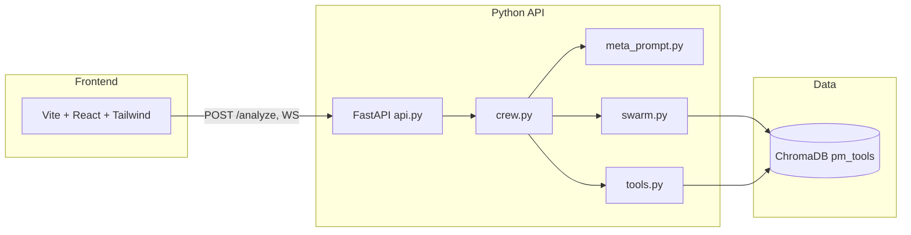

# War Room — The Multi-Model Adversarial Debate Engine That Replaces Opinion With Evidence-Backed Verdicts

[](https://www.python.org/)
[](https://fastapi.tiangolo.com/)
[](https://react.dev/)
[](LICENSE)

> Built at the **yconic New England Inter-Collegiate AI Hackathon 2026** by Griffin Kovach & Tucker Anglemyer.

**Interactive API docs (when the server is running):** [Swagger UI — `/docs`](http://127.0.0.1:8000/docs) · [ReDoc — `/redoc`](http://127.0.0.1:8000/redoc) · [OpenAPI JSON — `/openapi.json`](http://127.0.0.1:8000/openapi.json)

---

## Features

| Feature | Description |
|--------|-------------|
| **Adversarial debate** | Four CrewAI rounds, three personas, two Ollama model backends (configurable) |
| **RAG + swarm** | ChromaDB `pm_tools` (~31.7K chunks), 20-dimension scout briefing before Round 1 |
| **Streaming API** | `POST /analyze` + `WebSocket /ws/{session_id}` for round-by-round JSON |
| **Demo fallback** | Frontend typewriter demo if the backend is unreachable |
| **Optional video ingest** | `POST /api/ingest/video` — ffmpeg key frames + GPT-4o Vision (requires API key) |
| **Health** | `GET /health` for orchestration / demo checks |

---

## Quick architecture (Mermaid)



For a full ASCII pipeline diagram, see **Architecture** below.

---

## Repository layout

Canonical Python and CrewAI orchestration live at the **repository root**. There is no active top-level `backend/` directory; older experiments are under `archive/`.

**Root Python:** `api.py`, `config.py`, `crew.py`, `dgx_health.py`, `load_db.py`, `meta_prompt.py`, `process_screenshots.py`, `safe_crew.py`, `safe_load_db.py`, `swarm.py`, `tools.py`.

**Root Markdown:** `README.md`, `MASTER_PLAN.md`, `masterplan.md`, `ARCHITECTURE.md`, `DESIGN_DECISIONS.md`.

| Path | Role |
|------|------|
| `api.py` | FastAPI + WebSocket (`POST /analyze`, `WS /ws/{session_id}`), optional `POST /api/ingest/video` |
| `config.py` | Model IDs (`LOCAL_MODEL`, `DAILY_DRIVER_BUYER_MODEL`), Ollama base URL, Chroma paths, swarm limits, API host/port |
| `crew.py` | `build_crew()` — personas, swarm briefing, four-round sequential debate; **two** `LLM` instances (see Architecture) |
| `meta_prompt.py` | `generate_personas()` — JSON adversarial personas using the same `local_llm` as First-Timer; static fallback on parse failure |
| `swarm.py` | `deploy_swarm()` — 20 scouts via `ThreadPoolExecutor` (`MAX_WORKERS` from `config.py`) |
| `tools.py` | `_query_collection`, `fetch_context_for_product`, seven `@tool` search functions; **each debate agent receives `search_pm_knowledge` only** |
| `load_db.py` | Load processed JSON chunks into ChromaDB collection `pm_tools` |
| `process_screenshots.py` | Optional GPT-4o Vision → ChromaDB screenshot chunks |
| `safe_crew.py` | Optional DGX thermal-safe crew (one loaded model at a time) |
| `safe_load_db.py` | Optional batched Chroma ingest with checkpoints for thermal limits |
| `dgx_health.py` | Optional pre-flight GPU / Ollama checks |
| `requirements.txt` | Python dependencies |
| `scrapers/` | Data acquisition and preprocessing scripts |
| `frontend/` | Vite + React + TypeScript + Tailwind UI |
| `archive/` | **Legacy prototypes** — `streamlit_app.py`, `backend_v2/` (superseded parallel API stack) |

---

## Problem

Single-model AI gives shallow, sycophantic answers. When you ask one LLM to evaluate a product, it produces a polished, balanced summary — the kind of answer that gets a good rating on user studies and misses every critical flaw that actually causes churn. A 2023 Stanford study found that 73% of GPT-4 product evaluations failed to surface the top user complaints visible in public review data. Worse, the model's priors from training data systematically favor well-documented, well-funded tools, creating a bias that invisibly disadvantages newer or niche products. The problem is structural: a single model cannot hold genuinely conflicting perspectives simultaneously. It will always converge toward consensus — and consensus is the enemy of rigorous product evaluation.

---

## Solution

War Room delivers better product decisions by making three specialized AI **agents** (First-Timer, Daily Driver, Buyer) argue in a structured, evidence-grounded adversarial debate. Each agent gets a **dynamically generated** adversarial persona from `meta_prompt.py`. **Inference (as wired in `crew.py` / `config.py`):** two foundation-model backends — `LOCAL_MODEL` for the First-Timer (rounds 1 and 3), and a **shared** `DAILY_DRIVER_BUYER_MODEL` for Daily Driver and Buyer (rounds 2 and 4), both via Ollama at `LOCAL_BASE_URL`. That split still separates “new user” reasoning from “power user + buyer” reasoning while keeping the repo runnable on typical dev GPUs; you can extend to three distinct models on DGX by assigning separate `LLM` instances per agent. The output is not a summary: it is a buy/no-buy style verdict with a 1–100 score, prioritized fixes, and competitive framing — grounded in **31,668** deduplicated evidence chunks in ChromaDB (`pm_tools`) after a full `load_db.py` ingest (verify with `collection.count()` locally).

---

## Architecture

```
┌─────────────────────────────────────────────────────────────────────────────┐
│                            WAR ROOM PIPELINE                                │
└─────────────────────────────────────────────────────────────────────────────┘

USER INPUT
  │
  ▼
┌─────────────────────────┐
│  React + Tailwind UI    │  POST /analyze + WS /ws/{session_id}
│  (Debate Visualizer)    │◄─────────────────────────────────────────────────┐
└─────────────────────────┘                                                   │
  │                                                                           │
  ▼                                                                           │
┌─────────────────────────┐                                                   │
│   FastAPI + WebSocket   │  Streams one JSON message per completed round    │
│     api.py (port 8000)  │──────────────────────────────────────────────────┘
└─────────────────────────┘
  │
  ├──[Optional] POST /api/ingest/video
  │       │
  │       ▼
  │  ┌────────────────────────────────────────────────────┐
  │  │  VIDEO INGESTION PIPELINE (api.py)                 │
  │  │  ffmpeg scene-detect → key frames (≤30)            │
  │  │  GPT-4o Vision (high detail) → per-frame analysis  │
  │  │  GPT-4o text → journey synthesis report            │
  │  │  → VIDEO_EVIDENCE in-memory store                  │
  │  └────────────────────────────────────────────────────┘
  │
  ▼
┌─────────────────────────────────────────────────────────────────────────────┐
│  PHASE 0 — META-PROMPT PERSONA GENERATION  (meta_prompt.py)                 │
│                                                                             │
│  LLM generates 3 adversarial JSON personas for this specific product:      │
│   • The First-Timer  — skeptical new user, trusts App Store / Reddit       │
│   • The Daily Driver — power user, trusts HN / G2 long-form reviews        │
│   • The Buyer        — CTO with budget authority, trusts pricing / admin   │
│                                                                             │
│  Personas have CONFLICTING priorities by design. Static fallback on error. │
└─────────────────────────────────────────────────────────────────────────────┘
  │
  ▼
┌─────────────────────────────────────────────────────────────────────────────┐
│  PHASE 1 — SWARM RECONNAISSANCE  (swarm.py)                                 │
│                                                                             │
│  20 parallel scout agents query ChromaDB across 20 product dimensions:    │
│   onboarding • pricing • mobile • integrations • bugs • support •          │
│   competitors • missing features • UI/UX • collaboration • data export •   │
│   notifications • search • offline • learning curve • updates •            │
│   security • customization • automation • free-vs-paid                     │
│                                                                             │
│  ThreadPoolExecutor (10 workers) → compiled SWARM BRIEFING                 │
└─────────────────────────────────────────────────────────────────────────────┘
  │
  ▼
┌─────────────────────────────────────────────────────────────────────────────┐
│  PHASE 2 — RAG RETRIEVAL  (tools.py)                                        │
│                                                                             │
│  ChromaDB PersistentClient → collection: pm_tools (31,668 chunks)          │
│                                                                             │
│  Pre-fetch via fetch_context_for_product():                                 │
│   • 4 parallel semantic queries (onboarding, bugs, strengths, team)        │
│   • Metadata filters: app, source, type, subreddit, rating, URL            │
│   • Deduplication via seen_ids set                                          │
│                                                                             │
│  tools.py defines 7 @tool wrappers; crew agents use search_pm_knowledge only│
│   (+ fetch_context_for_product + swarm pre-inject into prompts)            │
│                                                                             │
│  Sources in corpus:                                                         │
│   Reddit (r/productivity, r/notion, r/projectmanagement, ...)              │
│   Hacker News (stories + comments)                                         │
│   Google Play reviews (4,000+ across 20 apps)                              │
│   App metadata (pricing, features, categories)                             │
│   GPT-4o vision descriptions of UI screenshots                             │
└─────────────────────────────────────────────────────────────────────────────┘
  │
  ▼
┌─────────────────────────────────────────────────────────────────────────────┐
│  PHASE 3 — ADVERSARIAL DEBATE  (crew.py, CrewAI sequential process)         │
│                                                                             │
│  ┌───────────────────────────────────────────────────────────────────────┐ │
│  │  ROUND 1 — First-Timer  (LOCAL_MODEL, e.g. ollama/llama3.1:8b)        │ │
│  │  Onboarding audit + 3 critical problems w/ evidence + 1 strength      │ │
│  └───────────────────────────────────────────────────────────────────────┘ │
│                              context chained ↓                             │
│  ┌───────────────────────────────────────────────────────────────────────┐ │
│  │  ROUND 2 — Daily Driver  (DAILY_DRIVER_BUYER_MODEL, shared LLM)       │ │
│  │  AGREE/DISAGREE each finding + 2 hidden long-term problems            │ │
│  └───────────────────────────────────────────────────────────────────────┘ │
│                              context chained ↓                             │
│  ┌───────────────────────────────────────────────────────────────────────┐ │
│  │  ROUND 3 — First-Timer  (same LOCAL_MODEL as round 1)                 │ │
│  │  Defend or concede each point + updated severity ratings              │ │
│  └───────────────────────────────────────────────────────────────────────┘ │
│                              context chained ↓                             │
│  ┌───────────────────────────────────────────────────────────────────────┐ │
│  │  ROUND 4 — Buyer  (same DAILY_DRIVER_BUYER_MODEL as round 2)           │ │
│  │  Business assessment + YES/NO/CONDITIONS + score/100 + TOP 3 FIXES   │ │
│  └───────────────────────────────────────────────────────────────────────┘ │
└─────────────────────────────────────────────────────────────────────────────┘
  │
  ▼
┌─────────────────────────────────────────────────────────────────────────────┐
│  PHASE 4 — VERDICT SYNTHESIS  (api.py _parse_verdict)                       │
│                                                                             │
│  Regex extraction: score/100 • YES/NO/YES WITH CONDITIONS • top 3 fixes    │
│  WebSocket delivery: one JSON message per round as it completes             │
│  Frontend renders live debate stream + final structured verdict             │
└─────────────────────────────────────────────────────────────────────────────┘

                        ┌──────────────────────────┐
                        │  Inference (default)      │
                        │  Ollama @ LOCAL_BASE_URL  │
                        │  • LOCAL_MODEL → R1,R3    │
                        │  • DAILY_DRIVER_BUYER_    │
                        │    MODEL → R2,R4 (shared) │
                        │  Optional: DGX / vLLM     │
                        │  with 3 separate LLM      │
                        │  instances (extend crew)  │
                        └──────────────────────────┘
```

---

## Inference hardware: what the repo assumes today

**Shipped defaults (`config.py`):** two Ollama models at `LOCAL_BASE_URL` — `LOCAL_MODEL` (default `ollama/llama3.1:8b`) for First-Timer rounds, and `DAILY_DRIVER_BUYER_MODEL` (default `ollama/llama3.3:60b`) shared by Daily Driver and Buyer. That is enough VRAM on many single-GPU workstations for hackathon demos and local development.

**Why DGX / vLLM still matter for the “three frontier models” story:** If you assign **three** distinct large open-weight models (e.g. Llama 3.3-70B + Qwen3-32B + Mistral-Small-24B) to the three personas, aggregate weight memory can exceed **~250 GB bf16** before KV caches — beyond a single consumer GPU. A **NVIDIA DGX Spark**-class box with **large unified memory** is the practical way to keep all three resident with tolerable round latency. This is **not** what `crew.py` does out of the box; it is the intended upgrade path: add separate `LLM(...)` instances per agent (and matching `config.py` entries / vLLM ports).

**Thermal safety:** For venue hardware, `safe_crew.py` can run **one** loaded model at a time between rounds instead of holding three giants simultaneously.

---

## Traction

> Usage metrics and real-world numbers will be added here as they come in.

---

## Technical Innovation

### Why multi-model adversarial debate is non-trivial — and why single-model chain-of-thought fails

The naive approach is chain-of-thought prompting: "Think like a skeptical user, then think like a power user, then synthesize." This fails for a structural reason: a single model cannot maintain genuinely conflicting positions simultaneously. When the same model plays both sides of an argument, it converges to its training prior. It writes an argument, then writes a counter-argument that is calibrated to seem "balanced" rather than to actually challenge the first. The model knows it wrote both sides. It does not argue — it performs arguing.

War Room separates **personas** from **weights**: three CrewAI agents get conflicting goals via `meta_prompt.py`, while **two** Ollama model IDs (see `crew.py`) drive inference — First-Timer on one model, Daily Driver and Buyer on another. That already breaks single-prompt “balanced summary” collapse: later rounds must respond to prior tasks’ outputs through CrewAI context chaining, and the Buyer still has to synthesize disputes. **Optional upgrade:** give each agent its **own** `LLM` and foundation model (e.g. on DGX + vLLM) for maximum cross-architecture disagreement.

### Why meta-prompting for persona generation is innovative

The personas are not hard-coded. Before every debate, War Room runs a meta-prompt: an LLM call that takes the product description and generates three adversarial personas with product-specific backstories, specific churned tools, specific workflows to test, and specific competing products to benchmark against. A debate about Notion generates different personas than a debate about Linear. This means the adversarial critique is calibrated to the actual competitive landscape of the product being evaluated — something impossible with fixed personas. The meta-prompt enforces a "CONFLICT REQUIREMENT": what persona 1 considers essential, persona 2 must consider bloat. This is not a feature of any standard multi-agent framework.

### Why the RAG dataset construction was novel

The 31,668-chunk `pm_tools` ChromaDB collection was not pulled from a single API. It was built by a multi-stage scraping and processing pipeline across five source types: Reddit (including r/productivity, r/notion, r/projectmanagement, and eight related subreddits), Hacker News (stories and comment threads), Google Play (4,000+ reviews across 20 apps), structured app metadata (pricing tiers, feature categories, integration lists), and UI screenshots analyzed by GPT-4o Vision (high-detail mode) using a structured UX analysis prompt that extracts friction points, strengths, and competitive comparisons as natural-language chunks. The screenshot ingestion pipeline (`process_screenshots.py`) is the novel piece: converting static UI images into semantically searchable evidence that agents can cite in arguments about specific UI patterns, onboarding flows, and navigation design. No existing RAG benchmark or hackathon dataset does this for PM tools.

### Why the swarm reconnaissance pattern is non-trivial

Before the first debate round begins, War Room deploys 20 parallel scout agents via `ThreadPoolExecutor` (10 concurrent workers), each querying the ChromaDB collection on a different product dimension (onboarding, pricing, mobile UX, integrations, bugs, etc.). The compiled swarm briefing is injected into Round 1 before the debate starts. This solves a real problem: small local models running on constrained hardware do not reliably execute multi-step ReAct tool-calling loops. By pre-fetching evidence through the swarm and injecting it directly into task prompts, War Room guarantees that every agent argument is grounded in real retrieved evidence — not hallucinated citations. This is an architectural decision that distinguishes production-quality agent systems from toy demos.

### Why local open-weight inference matters

Running the debate on **Ollama** (or vLLM) keeps product text and retrieved evidence off third-party chat APIs for the core loop. **Default:** two local models, no per-token cloud bill for rounds. **Optional:** add GPT-4o only for video frame analysis / screenshot ingestion (`api.py`, `process_screenshots.py`) when `OPENAI_API_KEY` is set.

---

## Tech Stack

### Inference
| Component | Technology | Notes |
|-----------|-----------|-------|
| First-Timer (rounds 1 & 3) | **`LOCAL_MODEL`** (CrewAI `LLM`) | Default `ollama/llama3.1:8b` at `LOCAL_BASE_URL` |
| Daily Driver + Buyer (rounds 2 & 4) | **`DAILY_DRIVER_BUYER_MODEL`** (shared `LLM`) | Default `ollama/llama3.3:60b` at `LOCAL_BASE_URL` |
| Optional DGX / vLLM | **Three separate `LLM` instances** | Not wired by default — extend `config.py` + `crew.py` with distinct model IDs and base URLs (e.g. ports 8001–8003) |
| Video frame analysis | **GPT-4o** (vision, high-detail) | Optional; OpenAI SDK in `api.py` when key present |
| Persona generation (`meta_prompt.py`) | Same as First-Timer | `generate_personas(..., local_llm)` uses `LOCAL_MODEL` |
| Local inference server | **Ollama** | Default `http://localhost:11434` |

### Hardware
| Component | Spec | Notes |
|-----------|------|-------|
| **Minimum (repo defaults)** | GPU that can run the two configured Ollama models | Typical dev / single-GPU setups |
| **Target (three frontier models)** | **NVIDIA DGX Spark** or similar with **large unified memory** | Needed when you assign **three** concurrent large models (70B-class + 32B + 24B) without aggressive quantization |
| **Venue safety** | `safe_crew.py` | Reduces concurrent loaded models for thermal headroom |

### Orchestration
| Component | Technology | Notes |
|-----------|-----------|-------|
| Agent framework | **CrewAI** (latest) | Sequential process, task_callback for streaming |
| Parallel scouts | **Python concurrent.futures** ThreadPoolExecutor | 10 workers, 20 scout queries |
| API server | **FastAPI** + **Uvicorn** | REST + WebSocket |
| Streaming | **WebSocket** (FastAPI native) | Round-by-round delivery |
| Background execution | **asyncio** + ThreadPoolExecutor | Non-blocking debate runs |

### RAG / Vector DB
| Component | Technology | Notes |
|-----------|-----------|-------|
| Vector database | **ChromaDB** (PersistentClient) | Collection: `pm_tools` |
| Embedding space | cosine similarity (`hnsw:space: cosine`) | Default ChromaDB embedding |
| Corpus size | **31,668 unique chunks** across 20 PM apps | Deduplicated by chunk ID |
| Metadata filters | `app`, `source`, `type`, `subreddit`, `rating`, `url` | Per-query filtering |

### Data Pipeline
| Component | Technology | Notes |
|-----------|-----------|-------|
| Reddit scraper | **PRAW** / no-auth PRAW fallback | `scrapers/02_scrape_reddit.py` |
| HN scraper | Custom Python scraper | `scrapers/03_scrape_hackernews.py` |
| App store scraper | Custom Python scraper | `scrapers/04_scrape_appstores.py` |
| Video download | `scrapers/05_download_videos.py` | Walkthrough video corpus |
| Frame extraction | `scrapers/07_extract_frames.py` + **ffmpeg** | Scene-change detection |
| Metadata generation | `scrapers/06_generate_metadata.py` | Pricing, features, categories |
| Chunk preprocessing | `scrapers/08_preprocess_chunks.py` | Normalization, dedup |
| Screenshot ingestion | **GPT-4o Vision** + `process_screenshots.py` | UX analysis → ChromaDB |
| DB loader | `load_db.py` | Batch 500, cosine collection |

### Frontend
| Component | Technology | Notes |
|-----------|-----------|-------|
| UI framework | **React** | Debate visualization |
| Styling | **Tailwind CSS** | |
| Real-time updates | **WebSocket** client | Live round streaming |

---

## How It Works (User Flow)

1. **Product submission** — User enters a product name, description, target user, competitors, key differentiator, and product stage via the React frontend or directly via `POST /analyze`.

2. **[Optional] Video ingestion** — User uploads a founder walkthrough video via `POST /api/ingest/video`. ffmpeg extracts key frames at scene boundaries (up to 30 frames). Each frame is analyzed by GPT-4o Vision with full product context and rolling narrative state. A final journey synthesis report is generated. All evidence is stored in `VIDEO_EVIDENCE` keyed by session UUID.

3. **Session initialization** — FastAPI creates a `DebateSession` with an asyncio Queue bridging the background thread to the WebSocket. The debate runs in a `ThreadPoolExecutor` worker so the event loop stays non-blocking.

4. **Meta-prompt persona generation** — `meta_prompt.py` calls the LLM with the product description and generates three JSON personas with specific conflicting priorities, cited tools they've churned from, and exact workflows to test. Falls back to static personas on JSON parse failure.

5. **Swarm reconnaissance** — `swarm.py` deploys 20 parallel scout agents (10 concurrent workers) querying ChromaDB across 20 product dimensions. Results are compiled into a SWARM BRIEFING injected into Round 1.

6. **RAG pre-fetch** — `tools.py::fetch_context_for_product` runs 4 semantic queries (onboarding friction, bugs/performance, strengths, team/pricing) against the `pm_tools` collection with app-name metadata filtering. Deduplicates by URL/chunk prefix. Formats evidence with source labels, ratings, and URLs.

7. **Round 1 — First-Timer** (`LOCAL_MODEL`): Onboarding audit step-by-step, 3 critical problems (each with exact failure moment, cited evidence, severity 1–10, named competitor alternative), and 1 genuine strength with evidence.

8. **Round 2 — Daily Driver** (`DAILY_DRIVER_BUYER_MODEL`): Reads Round 1 via CrewAI context chaining. Must AGREE or DISAGREE (labeled) on each finding with cited evidence — at least one disagree, at least one escalation. Exposes 2 hidden long-term problems invisible to first-timers. Challenges their competitor recommendation. Rates Round 1 quality 1–10.

9. **Round 3 — First-Timer** (`LOCAL_MODEL`, same instance as round 1): Reads Rounds 1–2. Defends or concedes each challenged point (rule: "you get used to it" is not a defense). Responds to the 2 hidden problems. Updates severity ratings with justification.

10. **Round 4 — Buyer** (`DAILY_DRIVER_BUYER_MODEL`, same instance as round 2): Reads Rounds 1–3. Settles every disagreement with evidence. Runs business-critical assessment (pricing, integrations, data portability, admin controls). Identifies the strategic market blind spot both analysts missed. Delivers: BUY DECISION (YES/NO/YES WITH CONDITIONS), OVERALL SCORE 1–100, TOP 3 FIXES (ranked, with sprint description, evidence citation, and estimated retention impact), COMPETITIVE POSITIONING.

11. **Streaming delivery** — Each round completion triggers the `task_callback`, which enqueues a JSON message `{round, agent_name, agent_role, content}` onto the asyncio Queue. The WebSocket coroutine forwards each message to the frontend in real time. The verdict is parsed via regex from the Round 4 output and delivered as a final structured `{type: "verdict", score, decision, top_3_fixes, full_report}` message.

---

## Setup & Run

### Prerequisites

- **Python 3.11 or 3.12** (recommended for the CrewAI / LangChain stack; **3.14+** may not be supported yet by upstream wheels)
- [Ollama](https://ollama.ai/) for local dev, or vLLM on NVIDIA DGX Spark for production
- ffmpeg (optional, for video ingestion): [ffmpeg.org](https://ffmpeg.org/download.html)
- OpenAI API key (optional, for video frame analysis and screenshot ingestion)
- ChromaDB data: either run the scraping pipeline or obtain `chroma_db/` from the team

### 1. Clone and install

```bash
git clone https://github.com/<your-org>/War-Room.git
cd War-Room
python -m venv .venv
# Windows:
.venv\Scripts\activate
# macOS/Linux:
source .venv/bin/activate

pip install crewai chromadb fastapi uvicorn websockets openai pydantic
```

### 2. Set environment variables

Copy the example file and adjust (optional — `config.py` has defaults when unset):

```bash
cp .env.example .env
# Edit .env to override LOCAL_MODEL, API_PORT, CHROMA_DB_PATH, etc.
```

```bash
# Required only for video ingestion and screenshot processing
export OPENAI_API_KEY=sk-...

# Windows PowerShell:
$env:OPENAI_API_KEY = "sk-..."
```

### 3a. Local development (Ollama)

```bash
# Pull models matching config.py defaults
ollama pull llama3.1:8b
ollama pull llama3.3:60b

# Verify Ollama is running at http://localhost:11434
ollama list
```

`config.py` defaults to `LOCAL_MODEL = "ollama/llama3.1:8b"`, `DAILY_DRIVER_BUYER_MODEL = "ollama/llama3.3:60b"`, and `LOCAL_BASE_URL = "http://localhost:11434"`. Pull both models in Ollama before running `crew.py` or `api.py`.

### 3b. DGX / vLLM — three distinct models (optional extension)

The repo ships with **two** `LLM` instances in `crew.py`. To run **three** separate foundation models (e.g. on vLLM ports 8001–8003), add three model string constants to `config.py`, then replace the shared `daily_driver_buyer_llm` pattern with **three** `LLM(...)` constructors (First-Timer, Daily Driver, Buyer) and assign `first_timer_llm`, `daily_driver_llm`, and `buyer_llm` accordingly. Commented `FIRST_TIMER_MODEL` / `DAILY_DRIVER_MODEL` / `BUYER_MODEL` stubs in `config.py` are **not** wired until you do this.

### 4. Load ChromaDB (if building from raw data)

```bash
# First, run scrapers in order (requires Reddit/HN API access or cached data):
python scrapers/02_scrape_reddit.py
python scrapers/03_scrape_hackernews.py
python scrapers/04_scrape_appstores.py
python scrapers/06_generate_metadata.py
python scrapers/08_preprocess_chunks.py

# Load into ChromaDB (pm_tools collection, cosine space):
python load_db.py

# Optional: ingest UI screenshots via GPT-4o Vision
python process_screenshots.py
```

Expected output: **31,668** unique chunks in `pm_tools` after a full ingest (matches `load_db.py` / team dataset). Verify locally:

```bash
python3 -c "import chromadb; c = chromadb.PersistentClient(path='./chroma_db'); print(c.get_collection('pm_tools').count())"
```

### 5. Start the API server

```bash
python api.py
# Server starts at http://0.0.0.0:8000
# WebSocket at ws://localhost:8000/ws/{session_id}
# OpenAPI: http://127.0.0.1:8000/docs  |  Health: curl http://127.0.0.1:8000/health
```

### 5b. Tests (lightweight)

```bash
pip install pytest python-dotenv
pytest test_crew.py -v
```

`test_crew.py` avoids importing CrewAI so it runs in minimal CI; full-stack tests live in `test_*.py` at the repo root.

### 6. Run a debate (CLI)

```bash
python crew.py
# Enter: Notion — all-in-one workspace for notes, docs, and databases
```

### 7. Run a debate (API)

```bash
# Start debate, get session_id
curl -X POST http://localhost:8000/analyze \
  -H "Content-Type: application/json" \
  -d '{
    "product_description": "Linear — modern issue tracker for software teams",
    "target_user": "10-person engineering team",
    "competitors": "Jira, GitHub Issues",
    "differentiator": "Speed and keyboard-first UX",
    "product_stage": "Growth"
  }'

# Returns: {"session_id": "uuid-here"}

# Connect WebSocket to stream rounds:
# ws://localhost:8000/ws/{session_id}
```

### 8. Run the swarm standalone

```bash
python swarm.py
# Enter product name to see all 20 scout results before the debate
```

---

## Design Decisions

**Why two model backends instead of one for everything:** A single model answering as three personas still tends to collapse toward one voice. Splitting First-Timer onto `LOCAL_MODEL` and Daily Driver+Buyer onto `DAILY_DRIVER_BUYER_MODEL` forces different sampling histories and system prompts across rounds while staying deployable on one or two GPUs. **Further upgrade:** three distinct foundation models (DGX + vLLM) when you need maximum architectural disagreement — see §3b.

**Why CrewAI sequential process over a custom multi-agent loop:** CrewAI's sequential process with `context=[...]` chaining gives us exact control over which prior outputs are injected into each task. The `task_callback` hook gives us round-level streaming over WebSocket without polling. The tradeoff is that CrewAI's ReAct tool-calling loop is unreliable with sub-10B models. We solved this by pre-injecting all RAG evidence into task prompts via `fetch_context_for_product` and swarm briefings — the models argue from evidence in their context window rather than needing to reliably execute tool calls.

**Why ChromaDB over Pinecone or Weaviate:** ChromaDB runs fully locally with `PersistentClient`, requires zero API keys or cloud infrastructure, and supports metadata filtering that maps directly to our source taxonomy (Reddit, HN, Google Play, metadata, screenshots). The tradeoff is that ChromaDB's default embedding model (all-MiniLM-L6-v2) is weaker than OpenAI ada-002 for semantic retrieval on long reviews. We accept this because the source-filtered queries (`where={"source": "reddit"}`) compensate by narrowing the retrieval space to the correct evidence type per agent persona.

**Why dynamic meta-prompt personas over fixed persona templates:** Fixed personas produce identical debate structure regardless of what is being evaluated. A fixed "CTO persona" applied to a solo productivity app is epistemically incoherent — the CTO would not evaluate Obsidian the same way they evaluate Monday.com. The meta-prompt generates personas whose specific churned-tool history, benchmarked competitors, and test workflows are calibrated to the actual product. The tradeoff is one additional LLM call at debate startup and JSON parse failure risk (mitigated by static fallback).

**Why a swarm pre-seeding pass over relying on ReAct tool calls in-debate:** Local LLMs at the 7B–8B parameter scale (used in dev) do not reliably execute multi-step tool-calling ReAct loops. They frequently skip the tool call, hallucinate a result, or call the tool with a malformed query. The swarm deploys 20 parallel queries before the debate starts and injects the results as pre-loaded context — guaranteeing that every agent has real retrieved evidence in its prompt regardless of whether it successfully executes tool calls during its round. The tradeoff is higher initial latency (the swarm adds ~3–8 seconds pre-debate) and increased total ChromaDB query load.

**Why WebSocket streaming over polling or server-sent events:** Each debate round takes 30–120 seconds on local hardware. Polling a `/status` endpoint would introduce latency and unnecessary load. SSE would work but WebSocket was chosen because the React frontend needs bidirectional capability for potential future user-interruption-of-debate features. The tradeoff is slightly more complex connection management (session cleanup on disconnect, asyncio Queue bridge between the thread pool and the event loop).

**Why ffmpeg scene-change detection over uniform-interval frame sampling for video ingestion:** Founder walkthroughs contain long stretches of typing or explanation with no UI change. Uniform frame sampling at 1 fps would produce 60–180 frames for a 2–3 minute video, most of which are near-identical. Scene-change detection (threshold=0.3) extracts only frames where the UI meaningfully changes, yielding 10–30 semantically distinct frames that cover the full product journey with no redundancy. The fallback to `fps=1/2` triggers only if fewer than 5 frames are detected, ensuring robustness to low-contrast videos.

---

## Alignment with yconic Hackathon Themes

**End-to-End Execution:** War Room is not a demo or a proof-of-concept. It is a complete system: a multi-stage data pipeline that produces **31,668** deduplicated chunks in `pm_tools`, a vector database with metadata filtering, a CrewAI orchestration layer with four sequential rounds and context chaining, a FastAPI backend with WebSocket streaming, a React frontend for real-time debate visualization, and an **optional** video ingestion path using GPT-4o Vision when `OPENAI_API_KEY` is set. The scraping pipeline (`scrapers/`), the ChromaDB loader (`load_db.py`), the debate engine (`crew.py`), the API server (`api.py`), and the frontend all ship together.

**100x Thinking:** One chat completion is a summary. War Room is a **contested** verdict: three personas, structured disagreement rules, swarm + RAG context, and chained rounds so later agents must answer what earlier ones actually wrote. **Shipped code** uses **two** foundation-model backends plus persona separation; you can scale to **three** models on big iron without changing the debate protocol.

**Agents That Hire Agents:** War Room's architecture has two layers of agent spawning. The meta-prompt (an LLM call via `local_llm`) generates the three adversarial personas for the debate. The swarm module (`swarm.py`) deploys 20 parallel scout queries to pre-seed Round 1. `tools.py` defines seven `@tool` functions, but **`crew.py` attaches `search_pm_knowledge` only** to each debate agent for in-round retrieval. Hierarchy: meta-persona generation → swarm briefing → debate with optional tool calls.

**Let's Cook OpenClaw:** Core debate inference uses **local open-weight** models through Ollama (`config.py`). **Optional** GPT-4o Vision is used only for video/screenshot ingestion when configured. **Target** DGX + vLLM setup: three distinct open-weight models — requires extending `crew.py` as documented in §3b.

---

## Request for Hacks Alignment

### "Let's Cook OpenClaw"
War Room is what happens after OpenClaw. OpenClaw opens the claw — War Room is what the claw grabs and tears apart.

The OpenClaw theme is about open-weight models doing real work. **This repository** runs the debate on **Ollama** with **two** configured open-weight backends (`LOCAL_MODEL` + `DAILY_DRIVER_BUYER_MODEL`) and three adversarial **personas** — already beyond a single generic chat completion. **Stretch goal:** wire **three** frontier open-weight models on **DGX + vLLM** (see §3b). Core critique/challenge/verdict work uses local open weights; optional GPT-4o is only for video/screenshot ingestion when enabled.

### "Agents That Hire Agents"
War Room operationalizes the "Agents That Hire Agents" theme at three tiers.

The meta-agent (an LLM call in `meta_prompt.py` using `local_llm`) generates the three adversarial **personas** for the debate — dynamically, per-product, with product-specific backstories and competing priorities. The swarm module deploys 20 parallel scout queries to pre-seed Round 1. Debate agents each carry **`search_pm_knowledge`** (`tools.py` also defines six other `@tool` wrappers for flexibility). Three levels deep in a single query: personas → scouts → debaters.

But beyond the hierarchy: the models dynamically critique, challenge, and build on each other's outputs across four escalating rounds. The Daily Driver must agree or disagree with each of the First-Timer's specific claims — labeled, with cited evidence, with at least one direct challenge required by the prompt structure. The Buyer must then settle each unresolved disagreement before delivering a verdict. This is emergent orchestration through adversarial tension, not a static pipeline where agents execute fixed tasks in sequence. The debate structure forces models to respond to what other models actually said — not to a template.

### "The Product That Builds Itself"
Every debate round in War Room is a self-improvement cycle operating within a single query.

Round 1 establishes a claim with evidence. Round 2 challenges that claim and forces a rating of Round 1's quality on a 1–10 scale. Round 3 must defend or concede each challenged point — with the explicit rule that "you get used to it" is not a valid defense. Round 4 synthesizes only the claims that survived challenge, discards what was successfully contested, and produces a verdict grounded in the strongest remaining evidence.

Each round's critique forces later rounds to strengthen or abandon claims. Weak arguments get challenged; stronger ones survive into the Buyer synthesis. The final verdict is not a single chat turn — it is what remains after **chained** CrewAI tasks with opposing personas (powered by **two** LLM backends in the default config) have stressed the reasoning. The product that builds itself, one debate round at a time.

---

## Demo

> Screenshots and demo video coming. Run `python crew.py` to see a full debate in the terminal, or start `python api.py` and open the React frontend for the streaming visualization.

**Sample output structure (Round 4 verdict):**
```
BUY DECISION: YES WITH CONDITIONS
OVERALL SCORE: 67/100

TOP 3 FIXES:
1. [Onboarding] ...
2. [Mobile performance] ...
3. [Export/data portability] ...

COMPETITIVE POSITIONING: ...
```

---

## Team

| Name | Role |
|------|------|
| **Griffin Kovach** | RAG pipeline architecture, ChromaDB data ingestion (scrapers, load_db.py, process_screenshots.py), tools.py, FastAPI/WebSocket backend (api.py), video ingestion pipeline, config |
| **Tucker Anglemyer** | CrewAI orchestration (crew.py), adversarial debate structure, meta-prompt persona generation (meta_prompt.py), swarm reconnaissance (swarm.py), agent prompt engineering, four-round debate design |

Built in 24 hours at the **yconic New England Inter-Collegiate AI Hackathon 2026**.
