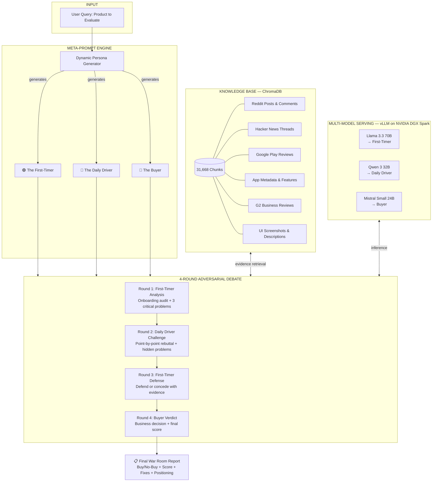

# ⚔️ The War Room

**Three AI architectures. Four rounds of adversarial debate. Real evidence. One verdict.**

War Room is a multi-model adversarial intelligence system that pressure-tests software products through structured debate between AI agents with fundamentally incompatible priorities — grounded in 31,668 real user evidence chunks, not training data hallucinations.

---

## What It Does

You give War Room a product. It builds three dynamically-generated personas with conflicting priorities, arms them with real user evidence from a 31K-chunk knowledge base, and forces them through four rounds of structured adversarial debate until a final buy/no-buy verdict emerges — backed by citations.

**This is not a chatbot.** This is adversarial intelligence.

---

## Architecture



---

## The Debate Protocol

| Round | Agent | Role | Constraints |
|-------|-------|------|-------------|
| **1** | 🟢 First-Timer | Onboarding audit + 3 critical problems with cited evidence | Must name specific competitors. Severity rated 1-10. |
| **2** | 🔵 Daily Driver | Challenge each finding, expose 2 hidden long-term problems | Must AGREE with ≥1 finding AND DISAGREE with ≥1. No fence-sitting. |
| **3** | 🟢 First-Timer | Defend or concede each challenge point | Cannot concede without counter-evidence. "You get used to it" is not a defense. |
| **4** | 🔴 Buyer | Settle all disagreements, business assessment, final verdict | Must deliver YES/NO/YES WITH CONDITIONS. Score 1-100. Top 3 fixes as sprint tickets. |

Each agent **must** query the knowledge base before making arguments. No speculation when real evidence exists.

---

## Data Pipeline

```
20 PM Apps Scraped
        │
        ▼
┌─────────────────────────────┐
│   Raw Data Sources          │
│  • Reddit (posts + comments)│
│  • Hacker News threads      │
│  • Google Play reviews      │
│  • G2 business reviews      │
│  • App metadata & pricing   │
│  • UI screenshots           │
└─────────────┬───────────────┘
              │
              ▼
┌─────────────────────────────┐
│   Processing                │
│  • Chunking & deduplication │
│  • 32,264 raw → 31,668     │
│    unique chunks            │
│  • Metadata tagging (app,   │
│    source, type, subreddit, │
│    URL)                     │
└─────────────┬───────────────┘
              │
              ▼
┌─────────────────────────────┐
│   ChromaDB                  │
│  • Collection: pm_tools     │
│  • Embeddings: MiniLM-L6-v2 │
│  • 31,668 vectors           │
│  • Queryable by any agent   │
└─────────────────────────────┘
```

**Apps covered:** Jira, Linear, Asana, Monday.com, Notion, ClickUp, Trello, Todoist, Basecamp, Height, Shortcut, Teamwork, Wrike, Smartsheet, Hive, Airtable, Coda, and more.

---

## Data Philosophy

The War Room knowledge base was **manually curated** before the hackathon — 31,668 chunks sourced, cleaned, deduplicated, and metadata-tagged across 20 project management applications. This is not a generic web scrape. Every chunk is a real user's experience: a Reddit post about migrating off Jira, a Hacker News thread debating Linear's architecture, a 1-star Play Store review about Monday.com's mobile app.

The pipeline is domain-agnostic. The same ingestion architecture scales to any vertical:
- **DevTools:** VS Code vs Cursor vs Windsurf — pull from GitHub Issues, Stack Overflow, HN
- **Healthcare SaaS:** Epic vs Cerner — pull from G2, physician forums, CMS compliance docs
- **FinTech:** Stripe vs Square vs Adyen — pull from developer docs, Reddit, integration reviews
- **EdTech:** Canvas vs Blackboard vs Moodle — pull from student forums, LMS admin communities

The 31,668 chunks are a proof of concept. The architecture supports millions.

---

## Tech Stack

| Layer | Technology | Purpose |
|-------|-----------|---------|
| **Orchestration** | CrewAI | Multi-agent sequential debate with context chaining |
| **Swarm** | Python ThreadPoolExecutor | 20 parallel scouts pre-gather evidence before debate |
| **Models** | Llama 3.3 70B, Qwen 3 32B, Mistral Small 24B | Three architectures, three perspectives |
| **Serving** | vLLM on NVIDIA DGX Spark | Local high-throughput inference |
| **RAG** | ChromaDB + all-MiniLM-L6-v2 | 31,668-chunk evidence retrieval |
| **Meta-Prompting** | Dynamic persona generation | Product-specific adversarial personas |
| **Frontend** | Streamlit | Real-time debate visualization |

---

## Why Multi-Model?

Single-model systems have a blind spot: **they agree with themselves.** War Room forces three fundamentally different architectures to argue from three fundamentally different user perspectives, grounded in real evidence. The result isn't consensus — it's a stress-tested verdict where every weakness has been attacked from multiple angles.

| Model | Architecture | Agent Role | Evidence Preference |
|-------|-------------|------------|-------------------|
| Llama 3.3 70B | Meta's dense transformer | First-Timer | App Store reviews, Reddit first impressions |
| Qwen 3 32B | Alibaba's MoE-hybrid | Daily Driver | G2 long-form reviews, HN technical threads |
| Mistral Small 24B | Mistral's efficient architecture | Buyer | Pricing data, feature matrices, business reviews |

Different training data. Different architectural biases. Different conclusions.

---

## Quick Start

```bash
# Clone
git clone https://github.com/tuckeranglemyer-pixel/War-Room.git
cd War-Room

# Install
pip install -r requirements.txt

# Run (local dev with Ollama)
ollama pull mistral:7b
python crew.py

# Run (DGX production — uncomment model configs in crew.py)
# Requires vLLM serving on DGX Spark
python crew.py
```

---

## Project Structure

```
War-Room/
├── crew.py            # 4-round adversarial debate pipeline + agent definitions
├── swarm.py           # Reconnaissance swarm — 20 parallel scouts pre-gather evidence
├── meta_prompt.py     # Dynamic persona generation via meta-prompting
├── tools.py           # ChromaDB RAG tools — 7 specialized search functions
├── requirements.txt   # Dependencies
├── chroma_db/         # 31,668-chunk knowledge base (gitignored)
└── README.md
```

---

## Team

**Griffin Kovstech** — Founder of [Clerion](https://clerion.co), an AI-powered academic intelligence platform integrated with Canvas LMS. Investor-backed. Built the RAG pipeline, data ingestion system, and evidence architecture.

**Tucker Anglemyer** — D1 athlete. Founder of Untracked. Built the CrewAI debate backend, meta-prompt persona engine, and multi-round orchestration system.

---

## Built At

**yconic Intercollegiate AI Hackathon** — March 28-29, 2026

Running on **NVIDIA DGX Spark** hardware.
